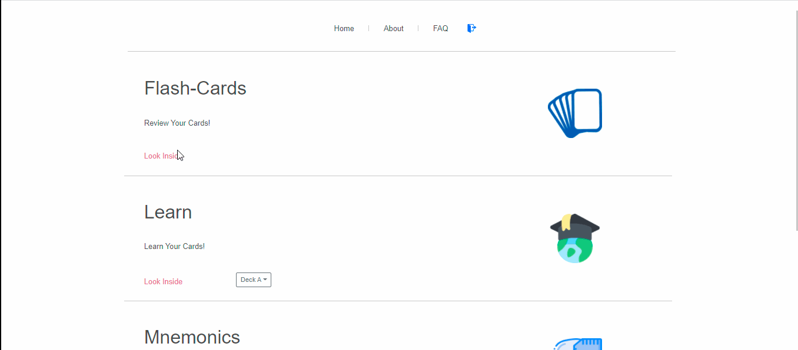
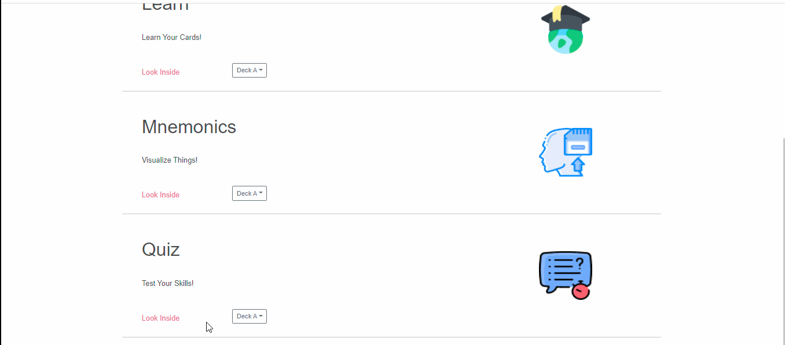
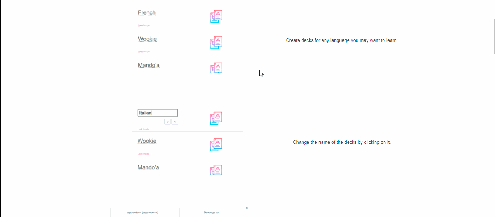

# Language Learner
A language learner that is more curtailed to how I think languages should be learned.

# Description
Language Learner is an online language learning app that I came up with after I couldn't find any simple way to learn languages consistently. 
You can add flashcards, quiz yourself on them, use "mnemonics" to remember better and all the simple things needed to just learn minus all the fancy pants language learning methods. [React JS + Firebase]

# Link
https://language-learner-us.web.app

# View

   
   

   
   

   
   

   

# Deployment
`npm run dev` or `firebase serve`
